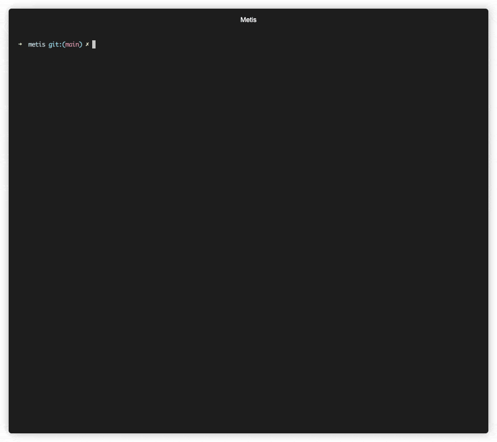

# Metis: AI-Powered Security Code Review

[](https://pre-commit.com/)
[](https://github.com/psf/black)
[](https://python.org)
[](https://securityscorecards.dev/viewer/?uri=github.com/arm/metis)
[](https://www.bestpractices.dev/projects/10876)
[](LICENSE)


Metis is an open-source, agentic AI security framework for deep security code review, created by [Arm's Product Security Team](https://www.arm.com/products/product-security). It helps engineers detect subtle vulnerabilities, improve secure coding practices, and reduce review fatigue. This is especially valuable in large, complex, or legacy codebases where traditional tooling often falls short.

**Metis** is named after the Greek goddess of wisdom, deep thought and counsel.

## Features

- **Deep Reasoning**
  Unlike linters or traditional static analysis tools, Metis doesn’t rely on hardcoded rules. It uses LLMs capable of semantic understanding and reasoning.

- **Deterministic Local Evidence**
  Reviews and triage emphasize source-local analysis, language plugins, and deterministic evidence collection over broad retrieval.

- **Plugin-Friendly and Extensible**
  Designed with extensibility in mind: support for additional languages, models, and new prompts is straightforward.

- **Issue validation**
  Validates findings from its own analysis and third-party SAST tools, gathering evidence to reduce false positives.

- **Provider Flexibility**
  Support for major LLM services and local models (OpenAI, Azure OpenAI, Anthropic, Gemini, AWS Bedrock, Bedrock Mantle, vLLM, Ollama, llama.cpp, LiteLLM etc.). See [Set up LLM Provider](#2-set-up-llm-provider).




### Supported Languages

Metis includes support for the following languages:

| Language | Review | Triage | Notes |
| --- | --- | --- | --- |
| C | CodeGraph Reachability with simple LLM fallback | Reachability with simple LLM fallback | Tree-sitter-backed CodeGraph; navigation-assisted fallback |
| C++ | CodeGraph Reachability with simple LLM fallback | Reachability with simple LLM fallback | Tree-sitter-backed CodeGraph; navigation-assisted fallback |
| Java | Language-plugin simple LLM review | Simple LLM triage | Tree-sitter code splitting; navigation-assisted triage |
| C# | Language-plugin simple LLM review | Simple LLM triage | Tree-sitter code splitting; navigation-assisted triage |
| Python | Language-plugin simple LLM review | Simple LLM triage | Tree-sitter code splitting; navigation-assisted triage |
| Rust | Language-plugin simple LLM review | Simple LLM triage | Tree-sitter code splitting; navigation-assisted triage |
| TypeScript | Language-plugin simple LLM review | Simple LLM triage | Tree-sitter code splitting; navigation-assisted triage |
| Terraform | Language-plugin simple LLM review | Simple LLM triage | Tree-sitter code splitting; navigation-assisted triage |
| Go | Language-plugin simple LLM review | Simple LLM triage | Tree-sitter code splitting; navigation-assisted triage |
| TableGen | Language-plugin simple LLM review | Simple LLM triage | Tree-sitter code splitting; navigation-assisted triage |
| Verilog | Language-plugin simple LLM review | Simple LLM triage | Tree-sitter code splitting; navigation-assisted triage |
| SystemVerilog | Language-plugin simple LLM review | Simple LLM triage | Verilog Tree-sitter code splitting; navigation-assisted triage |
| JavaScript | Language-plugin simple LLM review | Simple LLM triage | Tree-sitter code splitting; navigation-assisted triage |
| Kotlin | Language-plugin simple LLM review | Simple LLM triage | Tree-sitter code splitting; navigation-assisted triage |
| PHP | Language-plugin simple LLM review | Simple LLM triage | Tree-sitter code splitting; navigation-assisted triage |
| AArch64 Assembly | Language-plugin simple LLM review | Simple LLM triage | Tree-sitter code splitting; navigation-assisted triage |
| Jupyter Notebook | Language-plugin simple LLM review | Simple LLM triage | Python Tree-sitter code splitting; navigation-assisted triage |

For the current Reachability and simple LLM triage paths, see
[docs/triage-flow.md](docs/triage-flow.md).

Metis uses a plugin-based language system, making it easy to extend support to additional languages.

It supports ChromaDB, PostgreSQL with pgvector, and Qdrant vector-store backends.

## Getting Started

By default, Metis uses **ChromaDB** for local, no-setup usage. PostgreSQL with pgvector and Qdrant are available as optional backends.

### 1. **Installation**

After cloning the repository, you can either create a virtual environment or install dependencies system-wide.

To use a virtual environment (recommended):

```bash
uv venv
uv pip install .
```

or install system wide using --system:

```bash
uv pip install . --system
```

To install with **PostgreSQL (pgvector)** backend support:

```bash
uv pip install '.[postgres]'
```

To install with Qdrant backend support:

```bash
uv pip install '.[qdrant]'
```

### 1.1 **Docker**

```bash
git clone https://github.com/arm/metis.git

cd metis

docker build -t metis .
```

### 2. **Set up LLM Provider**

**OpenAI** (default)

Export your OpenAI API key before using Metis:

```bash
export OPENAI_API_KEY="your-key-here"
```

**Other providers**

Set `llm_provider.name` in `metis.yaml` and install the matching extra:

| Provider                 | `name`           | Install                              | Guide                                       |
|--------------------------|------------------|--------------------------------------|---------------------------------------------|
| OpenAI / Azure OpenAI    | `openai` / `azure_openai` | included                    | —                                           |
| Anthropic                | `anthropic`      | `uv pip install '.[anthropic]'`      | [docs](docs/providers/anthropic.md)         |
| Google Gemini / Vertex   | `gemini`         | `uv pip install '.[gemini]'`         | [docs](docs/providers/gemini.md)            |
| AWS Bedrock              | `bedrock`        | `uv pip install '.[bedrock]'`        | [docs](docs/providers/bedrock.md)           |
| Bedrock Mantle (Claude)  | `bedrock_mantle` | `uv pip install '.[bedrock-mantle]'` | [docs](docs/providers/bedrock_mantle.md)    |
| vLLM                     | `vllm`           | included                             | [docs](docs/providers/vllm.md)              |
| Ollama                   | `ollama`         | included                             | [docs](docs/providers/ollama.md)            |
| llama.cpp                | `llamacpp`       | included                             | [docs](docs/providers/llamacpp.md)          |

Or install everything with `uv pip install '.[all-providers]'`.

Embeddings are only required when using the `index` tool. To use a different
provider for embeddings than for chat (e.g. Anthropic chat + OpenAI
embeddings), add a separate `embedding_provider` block — see
[docs/providers/embedding-provider.md](docs/providers/embedding-provider.md).

### 3. Run Analysis

Run metis by also providing the path to the source you want to analyse:

```
uv run metis --codebase-path <path_to_src>
```

Run the security analysis across the codebase:
```
init
review_code
```

### 3.1 Docker

Go to your codebase path and run:
```bash
docker run --rm -it -v `pwd`:/metis metis
```

To pass environment variables use `-e`:
```bash
docker run --rm -it -v `pwd`:/metis -e "OPENAI_API_KEY=${OPENAI_API_KEY}" metis
```

You can pass arguments to metis:
```bash
docker run --rm -it -v `pwd`:/metis metis --non-interactive --command 'review_code' --output-file results/review_code_results.json
```

## Configuration

**Metis Configuration (`metis.yaml`)**

Metis ships with `src/metis/metis.yaml`. A project may provide `metis.yaml` in
the working directory or select another file with `--config PATH`. Metis uses
the selected file as its configuration source; it does not merge that document
with the packaged YAML. When a selected file omits `metis_engine.execution`,
Metis uses the packaged execution graph. When it defines that section, the
section is the complete graph.

Configuration covers:

- **LLM provider:** chat model and provider connection settings
- **Embedding provider:** models and connection settings used by Index
- **Engine behavior:** max workers, max token length, similarity top-k
- **Database connection:** In the case of PostgreSQL: host, port, credentials, and schema name
- **Index storage:** backend-specific storage parameters for commands that still use the index.
- **Capability settings:** index-search and navigation limits
- **Reachability:** path selection, path length, sink limits, and domain hints.

Project configuration is optional when the packaged defaults are suitable.

**Language Configuration**

Language manifests, prompt templates, and splitter settings are packaged under
`src/metis/plugins/`. External language packages expose a lightweight manifest
through the `metis.language_plugins` entry-point group. See the
[language plugin guide](docs/language-plugins.md) for the file layout, manifest
contract, and extension steps.

## Running Metis

Metis also provides an interactive CLI with several built-in commands:

### Global CLI Flags

- `--custom-prompt PATH` – optional `.md` or `.txt` file containing additional
  security-review guidance. If omitted, Metis uses `.metis.md` from the project
  root when that file exists.
- `--backend chroma|postgres|qdrant` – choose a vector-store backend (default `chroma`).
- `--project-schema` namespaces PostgreSQL schemas and Qdrant collections.
- `--chroma-dir` and `--qdrant-url` configure backend storage.
- `--triage` – after `review_code`, `review_dir`, `review_file`, or `review_patch`, triage findings and annotate SARIF output.
- `--include-triaged` – include findings already triaged by Metis when running triage.
- `--verbose` – show the stages and nodes executed by the selected graph.
- `--log-level` – configure Python logging independently of graph progress.
- `--quiet`, `--output-file`, `--output-files` – control console and export output.
- `--log-workflow-debug` – write a full local workflow trace containing prompts,
  model responses, tool calls, decisions, usage, and execution lifecycle data.
- `--log-workflow-debug-path PATH` – choose the trace directory or a new exact
  `.ndjson` path; this also enables workflow tracing.

See the [execution graph guide](docs/execution-graph.md) for stage, node, and
output configuration, the [workflow run-log format](docs/workflow-log-format.md)
for local trace capture, and
[adding a capability](docs/capabilities/adding-capability.md) for shared runtime
services and model-tool adapters.

### `init`
Initializes Metis repository context. When repository memory is enabled, this
loads threat-model memory first: configured
`metis_engine.threat_model.source_patterns` are stored as authoritative project
data. The packaged configuration includes common `SECURITY.*` and threat-model
filename patterns.
Metis distills those files into repository memory with the configured LLM. The
packaged execution graph does not build the vector index. Add the `index` node
to `initialize`, or run the `index` command, when retrieval is needed. Optional
git-history memory can add advisory security-review lessons; it never defines
binding project scope.

Use `--config PATH` to select a configuration with a different threat-model
source set.

### `index`
Builds the vector index used by `ask`, `update`, and nodes that use the Index
capability.

### `review_code`
Runs the configured Review stage over the codebase. The packaged graph uses the
CodeGraph and Reachability nodes. Files without CodeGraph support are skipped
by Reachability and reviewed by the simple LLM fallback.

### `review_dir`
Runs the configured Review stage and limits findings to the selected directory.

### `review_file <path>`
Runs the configured Review stage and limits findings to the selected file.

### `review_patch <patch.diff>`
Runs the configured Review stage for a diff. Patch analysis requires a graph
that selects `simple_llm_review`; the packaged Reachability node reports patch
requests as inconclusive.

### `update <patch.diff>`
Incrementally updates the index using a diff. Avoids full reindexing.

### `ask <question>`
Ask questions against the indexed codebase.

### `triage <findings.sarif>`
Triages findings in a SARIF file and annotates each result with Metis triage metadata.
You can use this command on SARIF generated by Metis or by other security/static-analysis tools.
See [docs/triage-flow.md](docs/triage-flow.md) for a short overview of how triage works.

## Running in Non-Interactive Mode

Metis also supports a non-interactive mode, useful for automation, CI/CD pipelines, or scripted usage.

To use Metis in non-interactive mode, use the --non-interactive flag along with --command:

```bash
metis --non-interactive --command "<command> [args...]" [--output-file <file.json>]
```

## Examples

#### Example 1: Chroma (default)

```bash
metis --codebase-path <path_to_src>
```

#### Example 2: Postgres

If you prefer not to use the default ChromaDB backend, you can switch to PostgreSQL either using a local installation or the provided Docker setup.

To get started quickly, run:

```bash
docker compose up -d
```

This will launch a PostgreSQL instance with the pgvector extension enabled, using the credentials specified in your `docker-compose.yml`.

Then, run Metis with the PostgreSQL backend:

```bash
metis \
  --project-schema myproject_main \
  --codebase-path <path_to_src> \
  --backend postgres
```

For embedding models above pgvector's normal-vector HNSW limit, such as
3072-dimensional embeddings, Metis automatically enables pgvector `halfvec`
storage for the PostgreSQL backend so HNSW indexes can still be created. You
can override this in `metis.yaml`:

```yaml
metis_engine:
  embed_dim: 3072
  pgvector_use_halfvec: auto  # auto, true, or false
```

#### Example 3: Qdrant

Qdrant must be running as a server. See the [Qdrant quickstart](https://qdrant.tech/documentation/quickstart/) for setup details, or start a local server with Docker:

```bash
docker run -p 6333:6333 qdrant/qdrant
```

Metis connects to localhost by default:

```bash
metis --backend qdrant --project-schema myproject
```

For another Qdrant Server or Qdrant Cloud endpoint, pass `--qdrant-url` or set `QDRANT_URL`. Set `QDRANT_API_KEY` when authentication is required. Metis creates `<project-schema>_code` and `<project-schema>_docs` collections.

#### Example 4: Usage and output


```bash
> review_file src/memory/remap.c
```

Vulnerable source code:
```c
// Remap memory addresses from one region to another
for (uint32_t* ptr = start; ptr < end; ptr++) {
    uint32_t value = *ptr;
    if (value >= OLD_REGION_BASE && value < OLD_REGION_BASE + REGION_SIZE) {
        value = value - OLD_REGION_BASE + NEW_REGION_BASE;
    }
}
```

Example output:

```bash
File: src/memory/remap.c
Identified issue 1: Address Remapping Loop Does Not Update Memory
Snippet:
for (uint32_t* ptr = start; ptr < end; ptr++) {
    uint32_t value = *ptr;
    if...
Why: In the remap_address_table function, the code is intended to adjust address references from an old memory region to a new one. However, the updated value stored in the local variable 'value' is never written back into memory at the pointer location (*ptr). This means the address entries remain unchanged, which can lead to unintended behavior if the system relies on those values being relocated correctly.
Mitigation: Update the loop so that after computing the new address, the value is written back. For example:
for (uint32_t* ptr = start; ptr < end; ptr++) {
    uint32_t value = *ptr;
    if (value >= OLD_REGION_BASE && value < OLD_REGION_BASE + REGION_SIZE) {
        value = ((value - OLD_REGION_BASE) + NEW_REGION_BASE);
        *ptr = value;
    }
}
This ensures that each entry is properly updated to point to the relocated memory region.
Confidence: 1.0
```

#### Example 4: Run a full security review (non-interactive)

```bash
metis --non-interactive --command "review_code" --output-file results/full_review.json
```

#### Example 5: Review and auto-triage findings into SARIF

```bash
metis --non-interactive \
  --triage \
  --command "review_patch changes.diff" \
  --output-file results/review.json \
  --output-file results/review.sarif
```

#### Example 6: Triage an existing SARIF file in place

```bash
metis --non-interactive --command "triage results/review.sarif"
```

#### Example 7: Triage an existing SARIF file into a new output file

```bash
metis --non-interactive \
  --include-triaged \
  --output-file results/retriaged.sarif \
  --command "triage results/review.sarif"
```


## License

Metis is distributed under Apache v2.0 License.
